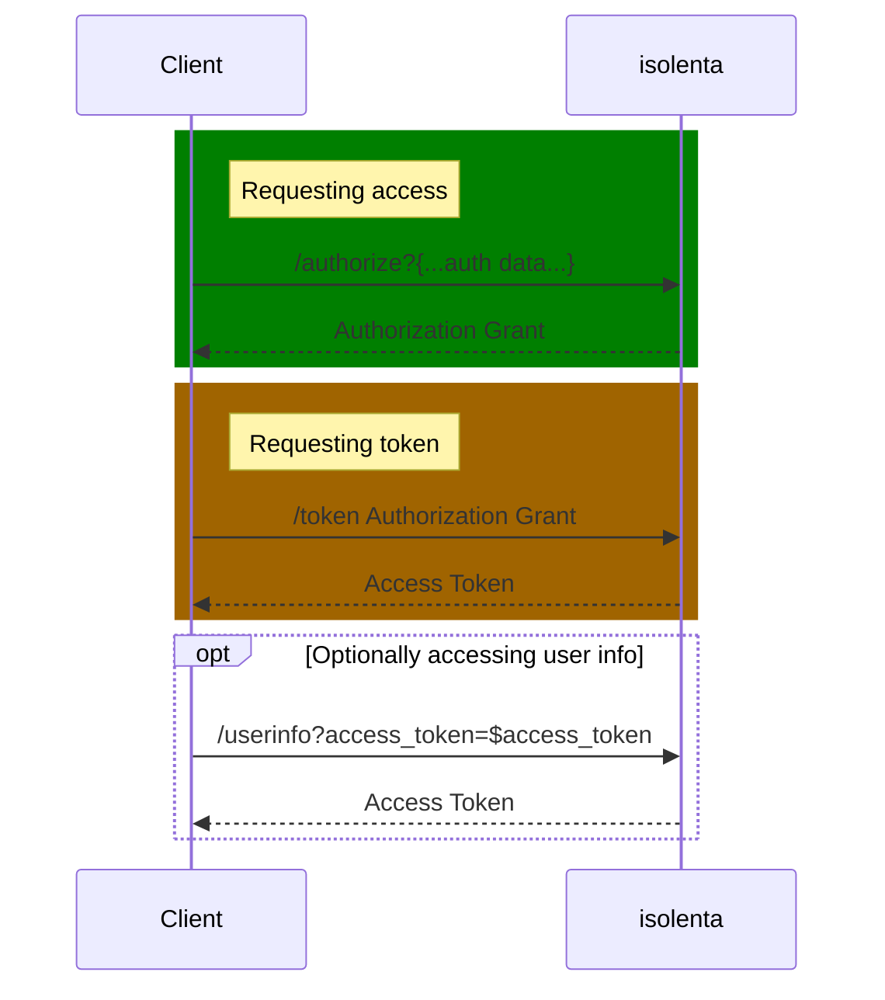

# isolenta

OAuth2 server for local development

```
❌❌❌❌❌❌❌❌❌❌❌❌❌❌❌❌❌❌
❗️NOT FOR PRODUCTION USAGE❗️
❌❌❌❌❌❌❌❌❌❌❌❌❌❌❌❌❌❌
```

## Installation

From source: `go install -trimpath github.com/ninedraft/isolenta`

From github releases:
- go to <https://github.com/ninedraft/isolenta/releases>
- download latest binary for your OS and Arch
- copy it to any place you want
- goto [Usage](#usage)

## Usage
Run `isolenta` - it will load isolenta.toml config.
Use `-config $config.toml` key to specify custom config filename.
Use `-h` to print help message.

Example config (run `isolenta -example-config` to print to stdout.)

```toml
serve-at = 'localhost:9478' # domain name for serving. Never serve on public address.

[[user]]
id = '1234' # for testing purposes user.id == client.id
unsafe-secret = 'test-secret'
domain = 'localhost:8080' 
unsafe-password = 'test-password' # set if you want to support basic auth for this user

```

## API 

Following handles are available:

- `/authorize` - generate access grant with requestes scopes, states, etc.
- `/token` - generate access token
- `/userinfo` - fetch auth user info


